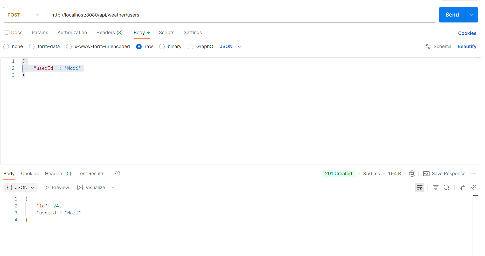
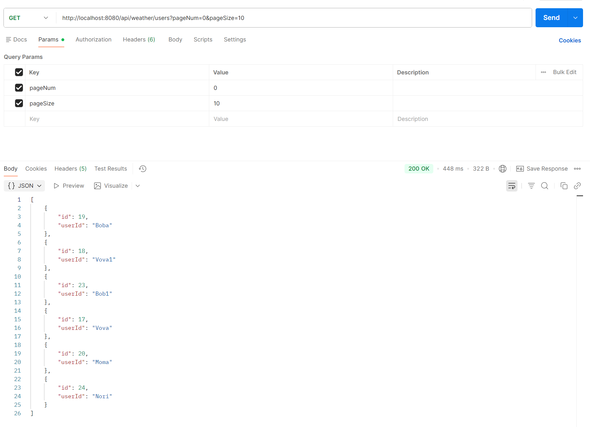
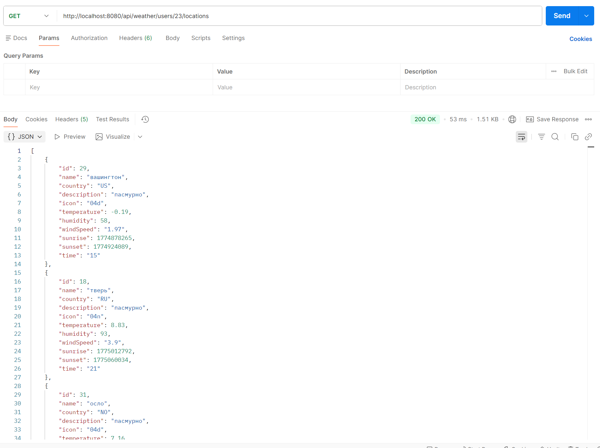
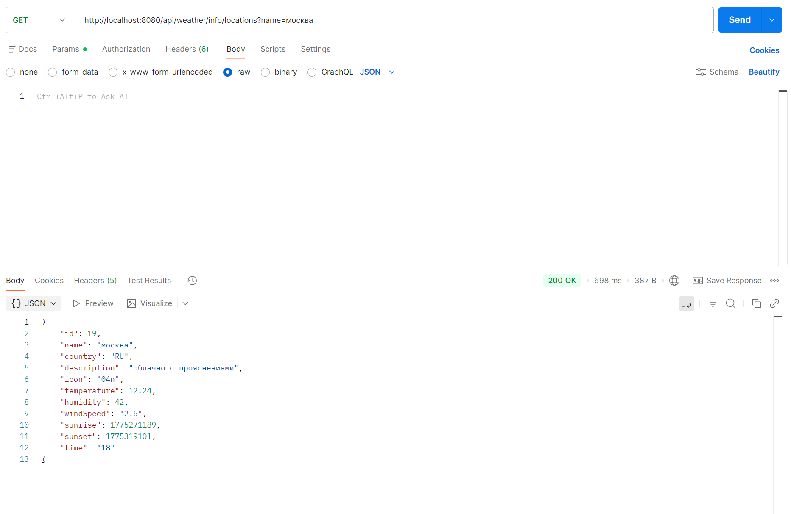
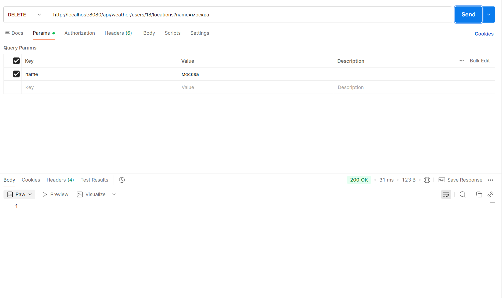
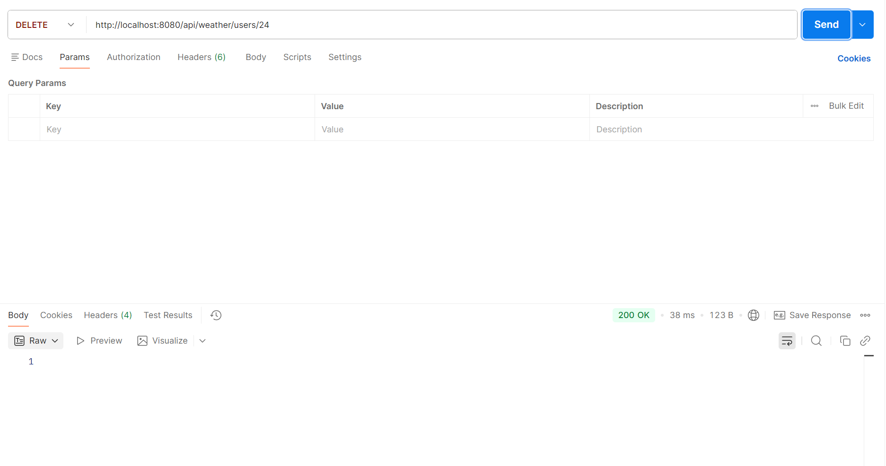
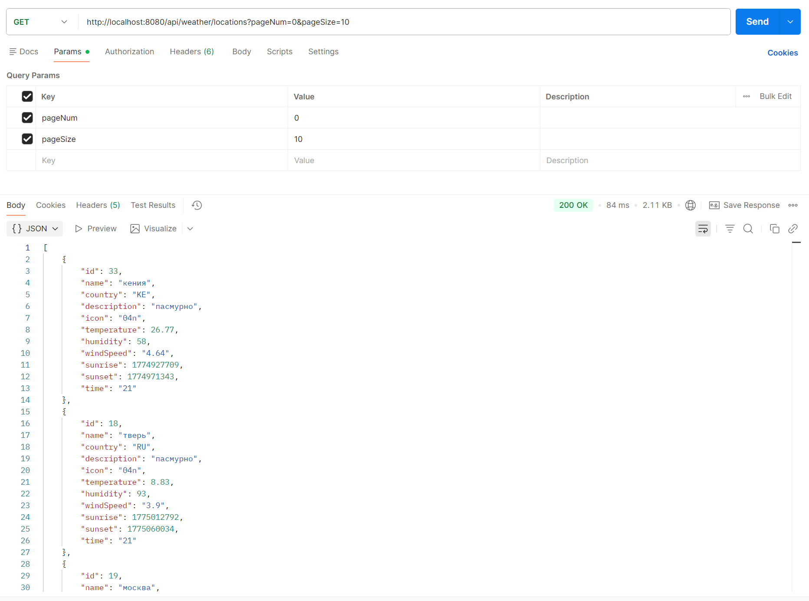
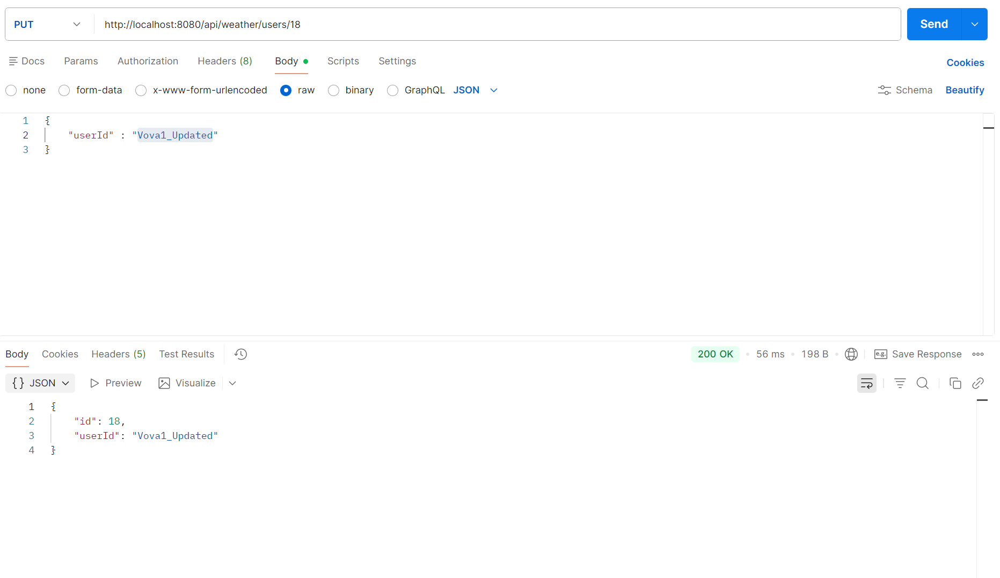
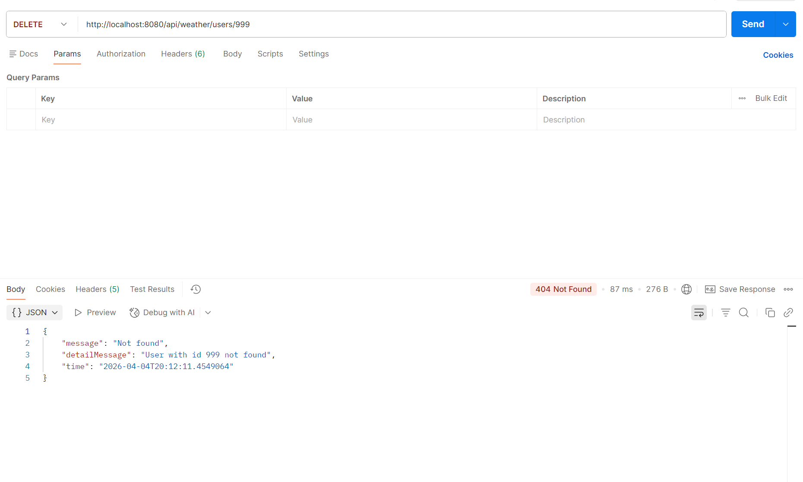
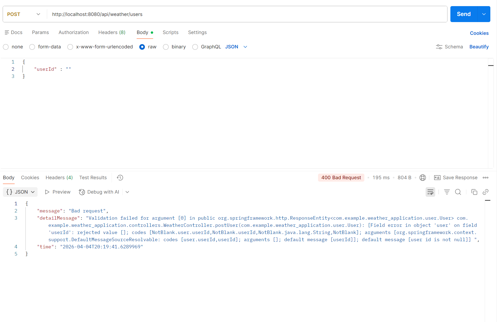

_**Weather Application**_
REST API приложение для управления избранными локациями и получения актуальной погоды.
Пользователи могут добавлять города в избранное, удалять их и получать свежие данные о погоде с автоматическим кэшированием.

_**Оглавление**_
- О проекте
- Стек технологий
- Что умеет приложение
- Проблемы и моменты, с которыми столкнулся
- Как запустить
- API-эндпоинты
- Примеры запросов (Postman)
- Тестирование
- Дальнейшие планы развития проекта
- Контакты

_**О проекте**_
Данный проект я разработал с целью отточить навыки создания полноценных Spring Boot REST API-приложений. На данный момент в нём можно добавлять себе локации
в избранное и смотреть погоду. Данные берутся из OpenWeatherMap.

_**Технологии**_
* Язык - Java 21
* Фреймворк - Spring Boot 4.x
* БД - PostgreSQL, H2 (тесты)
* ORM - Spring Data JPA (Hibernate)
* Сборка - Maven
* Тестирование - JUnit 5, Mockito, Spring Boot Test

_**Что умеет приложение?**_
**Пользователи:**
  * Регистрация - создание нового пользователя с уникальным userId
  * Просмотр всех пользователей - с пагинацией
  * Обновление данных - изменить userId
  * Удаление - пользователь удаляется вместе со всеми связями
**Локации:**
  * Добавление локации - пользователь может добавить локацию в избранное
  * Просмотр избранных локаций - список всех локаций пользователя
  * Удаление локации - можно удалить конкретную локацию из избранного
  * Защита от дублей - нельзя добавить одну локацию пользователю
**Погода:**
  * Получение погоды по названию - запрос к OpenWeatherMap API
  * Умное кэширование - данные хранятся в БД 3 часа, затем обновляются
**Дополнительно**
  * Пагинация - данные пользователей/локации можно посмотреть в пагинированном виде
  * Динамические фильтры - искать пользователей/локации можно по нескольким параметрам (фильтрам)
  * Глобальная обработка ошибок - единый формат ответов об ошибках
  * Логирование - все события логируются
  * Тесты - покрыты основные сценарии

_**Проблемы и моменты, с которыми столкнулся**_
_Проблема_: Поначалу я хранил локации пользователя отдельным полем в БД в виде строки с пробелами ("москва париж зимбабве ").
То есть у меня эта строка сплитилась просто по пробелу, когда нужна была локация, допустим для проверки на наличие.
Потом я понял, что это очень нестабильно, так как могут быть локации, которые содержат названия других локаций в своем названии.
Плюс к этому, для того, чтобы получить локацию, я каждый раз обращался к БД.
Решением стало реализация связи Many-to-Many с помощью вспомогательной таблицы со связями users_locations.
Понял, что никогда не стоит хранить связные данные в строке, это можно назвать анти-паттерном.
_Проблема_: Данные о погоде не обновлялись в случае, если временной интервал тот же, но день другой.
Просто добавил новое поле lastUpdated к энтити локации, плюс написал проверку.
_Проблема_: TransientPropertyValueException ошибка при сохранении пользователя с новой локацией. Из-за того, что
сохранял пользователя раньше локации, возникала ошибка трансиентности, так как локация оставалась в, так сказать, незавершенном состоянии.

_**Как запустить?**_
**Шаг 1: Требования**
  * Java 21 (java -version)
  * Maven 3.8+ (mvn -version)
  * PostgreSQL любая (psql --version)
**Шаг 2: Клонирование репозитория**
  * git clone https://github.com/ewaw01/Weather-application.git
  * cd Weather-application
**Шаг 3: Создать БД**
  * Запускаем PostgreSQL (можно в контейнере Docker)
  * Создаем БД: CREATE DATABASE weather_db;
  * Можно также через командную строку: createdb -U postgres weather_db
**Шаг 4: Получить API ключ OpenWeatherMap**
  * Зарегистрируйся на OpenWeatherMap
  * Перейди в раздел "My API Keys"
  * Скопируй свой API ключ (или создай новый)
**Шаг 5: Настройка конфигурации**
  * БД настройки:
    spring.datasource.url=jdbc:postgresql://localhost:5432/weather_db
    spring.datasource.username=postgres
    spring.datasource.password=your_password
  * JPA настройки:
    spring.jpa.hibernate.ddl-auto=update
    spring.jpa.show-sql=true
    spring.jpa.properties.hibernate.format_sql=true
  * OpenWeatherMap API:
    openweather.api.key=YOUR_API_KEY_HERE
    openweather.api.base-url=https://api.openweathermap.org/data/2.5
    openweather.defaults.units=metric
    openweather.defaults.lang=ru
  * Требуется заменить your_password на свой пароль PostgreSQL, а YOUR_API_KEY_HERE на реальный API ключ
**Шаг 6: Запуск приложения**
  * ./mvnw spring-boot:run

_**API-эндпоинты**_
Все эндпоинты имеют базовый url: /api/weather
**Пользователи:**
  - POST /users - создать нового пользователя
  - GET /users - получить список пользователей (с фильтрацией и пагинацией). Параметры:
    id, userId, pageNum, pageSize (все параметры необязательные)
  - PUT /users/{id} - обновить данные пользователя
  - DELETE /users/{id} - удалить пользователя
  - GET /users/{id}/locations - получить все локации пользователя
  - PUT /users/userId/locations - добавить локацию пользователю
  - DELETE /users/{id}/locations - удалить локацию у пользователя (по названию)
**Локации и погода**
  - GET /locations - получить список всех локаций (с фильтрацией и пагинацией). Параметры:
    id, name, country, description, icon, temperature, humidity, windSpeed, sunrise, sunset, time, pageNum, pageSize (все параметры необязательные)
  - GET /info/locations - получить погоду по названию локации
  - DELETE /locations/{id} - удалить локацию из кэша

_**Примеры запросов (Postman)**_
1. Создать пользователя:
   POST http://localhost:8080/api/weather/users
   body:
   {
    "userId" : "Nori"
   }
   Скриншот из Postman:
   

2. Получить всех пользователей с пагинацией:
   GET http://localhost:8080/api/weather/users?pageNum=0&pageSize=10
   Скриншот из Postman:
   

3. Добавить локацию пользователю:
   PUT http://localhost:8080/api/weather/users/18/locations
   body:
   {
    "name" : "Москва"
   }
   Скриншот из Postman:
   

4. Получить локации пользователя:
   GET http://localhost:8080/api/weather/users/23/locations
   Скриншот из Postman:
   

5. Получить погоду по названию локации:
   GET http://localhost:8080/api/weather/info/locations?name=москва
   Скриншот из Postman:
   

6. Удалить локацию у пользователя:
   DELETE http://localhost:8080/api/weather/users/18/locations?name=москва
   Скриншот из Postman:
   

7. Удалить пользователя:
   DELETE http://localhost:8080/api/weather/users/1
   Скриншот из Postman:
   

8. Получить все локации (кэш):
   GET http://localhost:8080/api/weather/locations?pageNum=0&pageSize=10
   Скриншот из Postman:
   

9. Обновить пользователя:
   PUT http://localhost:8080/api/weather/users/18
   body:
   {
    "userId" : "Vova1_Updated"
   }
   Скриншот из Postman:
   

Пару примеров ошибок:
11. Ошибка 404 — пользователь не найден:
    DELETE http://localhost:8080/api/weather/users/999
    Скриншот из Postman:
    

12. Ошибка 400 — неверные данные:
    POST http://localhost:8080/api/weather/users
    body:
    {
     "userId" : ""
    }
    Скриншот из Postman:
    

_**Тестирование**_
Проект покрыт unit-тестами и интеграционными тестами.
  - Junit5 + Mockito - для сервисного слоя
  - @WebMvcTest - для тестирования REST API
  - @DataJpaTest - для тестирования репозиториев
Проверяются:
  - CRUD операции с пользователями и локациями
  - Кэширование погоды (проверка временных интервалов)
  - Добавление и удаление локаций у пользователя
  - REST эндпоинты и HTTP статусы (200, 201, 400, 404)
  - Глобальная обработка ошибок
Всего тестов 40+, покрытие кода ~75%
Запустить тесты: ./mvnw test

_**Дальнейшие планы развития проекта**_
1. Кэширование — добавить Redis для более эффективного кэширования погоды
2. Безопасность — внедрить Spring Security с JWT аутентификацией
3. Docker — контейнеризация приложения и базы данных
4. Документация API — подключить Swagger/OpenAPI
5. CI/CD — настроить автоматическое тестирование через GitHub Actions
6. Telegram бот — добавить возможность получать погоду в Telegram (Telegram Web Apps)
7. Функционал — сохранять историю запросов пользователя, автоматическое определение города по IP

_**Контакты**_
- GitHub: [github.com/ewaw01](https://github.com/ewaw01)
